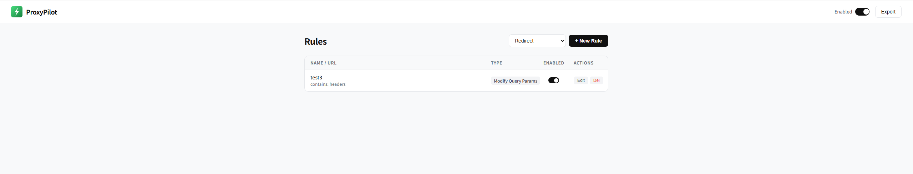
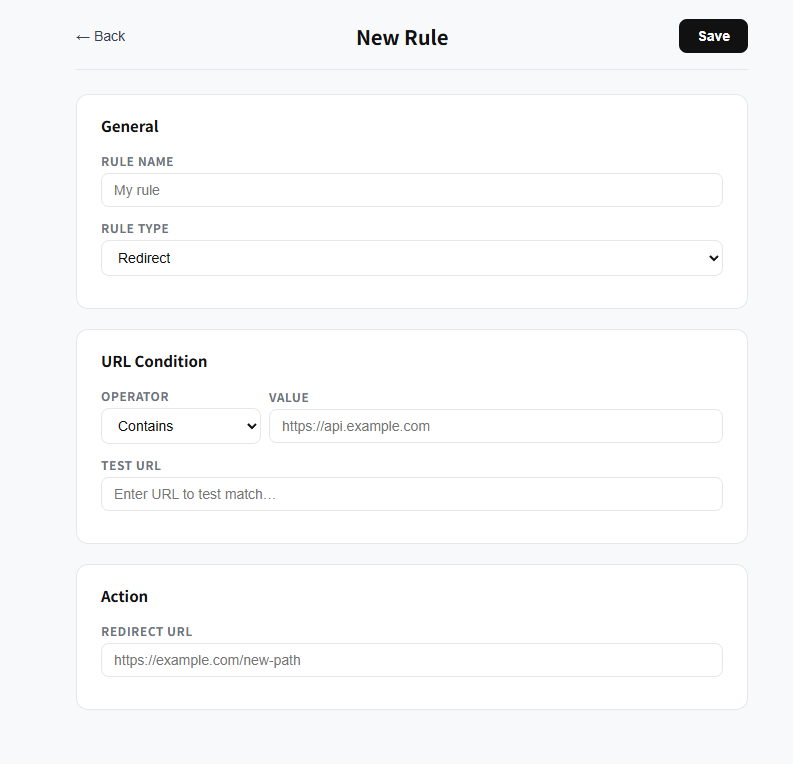

# ProxyPilot

A Manifest V3 Chrome extension for intercepting and modifying HTTP requests and responses — redirect, block, mock, modify headers/body, inject scripts, add delay, and more.

> Inspired by [Requestly](https://requestly.io). Built on top of its open-source page-layer interceptor (AGPL-3.0).

---

## Screenshots

**Rules dashboard**



**Create / edit a rule**



---

## Features

| Rule | Description | Engine |
|---|---|---|
| **Redirect** | Redirect a matching URL to another | DNR |
| **Block** | Cancel matching requests | DNR |
| **Modify Headers** | Set / append / remove request or response headers | DNR |
| **Mock Response** | Replace response body, status code; optionally serve without a real request | Page layer |
| **Modify Request Body** | Replace or rewrite the request payload | Page layer |
| **Delay** | Add artificial latency to matching requests | Page layer |
| **Insert Script** | Inject custom JS or CSS into a page | DNR (scripting) |
| **Replace String** | Swap a substring in the matched URL | DNR |
| **Modify Query Params** | Add, override, or remove URL query parameters | DNR |
| **User Agent** | Override the `User-Agent` header | DNR |

### URL matching operators

`Contains` · `Equals` · `Regex` · `Wildcard (*)`

Optional filters: HTTP method, resource type.

---

## Installation

```bash
git clone https://github.com/deenrookie/proxypilot-extension.git
cd proxypilot-extension
npm install
npm run build
```

Then load the extension in Chrome:

1. Open `chrome://extensions`
2. Enable **Developer mode** (top-right toggle)
3. Click **Load unpacked**
4. Select the `dist/` folder

---

## Usage

| Where | What you can do |
|---|---|
| **Toolbar popup** | Master on/off toggle · quick enable/disable per rule · open full editor |
| **Options page** | Create, edit, delete, reorder rules · live URL match tester · import / export JSON |

### URL tester

Every rule editor has a **Test URL** field. Paste any URL and the UI shows immediately whether the current condition matches.

### Import / Export

Click **Export** in the options page header to download a JSON snapshot of all rules. To restore, paste it back into the same field and click **Import**.

---

## Architecture

ProxyPilot uses a **dual-layer** interception model because MV3 removed blocking `webRequest`:

```
chrome.storage.local
        │
        ▼
background.js  (Service Worker)
        ├── DNR path  →  chrome.declarativeNetRequest
        │                (Redirect, Block, Headers, Query params, Replace, UA)
        └── Page path →  content-script.js  ──postMessage──▶  interceptor.js
                         (ISOLATED world bridge)               (MAIN world)
                                                               Overrides fetch / XHR
                                                               (Mock, Request body, Delay)
```

| File | Role |
|---|---|
| `background.js` | Compiles rules → DNR; pushes page-layer rules to each tab; toggles the toolbar icon |
| `content-script.js` | Bridge between extension and page; relays rules and intercept logs |
| `interceptor.js` | MAIN world; overrides `fetch` / `XMLHttpRequest`; hooks are installed **lazily** — never executed when the extension is disabled |
| `popup` | Toolbar UI — master toggle + per-rule quick toggle |
| `options` | Full rule editor — CRUD, URL tester, import/export |

### Lazy hook installation

When the extension is **disabled**, `interceptor.js` loads but installs **zero hooks** on `XMLHttpRequest` or `fetch`. The toolbar icon switches to gray. Re-enabling restores full interception without a page reload.

### interceptor.js lineage

Derived from the open-source Requestly page interceptor (AGPL-3.0). All Requestly-specific identifiers, external reporting endpoints, and telemetry have been removed. Original copyright: Requestly contributors.

---

## Development

```bash
npm run dev       # watch mode — rebuilds on every save
npm test          # unit tests (URL matcher + DNR compiler, 29 tests)
npm run gen:icons # regenerate PNG icons from assets/icons/icon.svg
npm run build     # production build → dist/
```

---

## Known limitations

- **Response body modification** requires the page-layer interceptor. Requests made before `document_start` may not be captured.
- **CSP-strict pages** can block Insert Script rules.
- Chrome caps `declarativeNetRequest` dynamic rules at ~5 000 entries.
